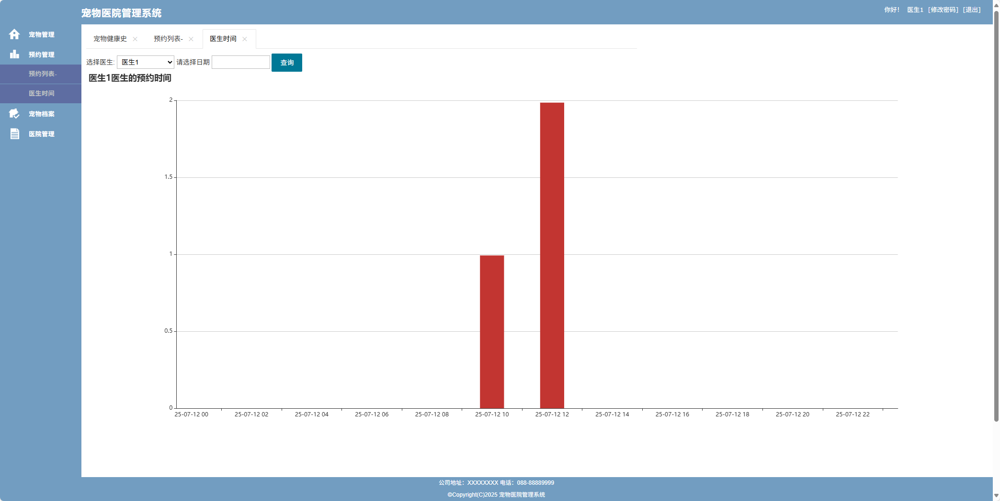

# 宠物医院管理系统_2(文末免费领取☟)
> 
#### 介绍
宠物医院管理系统_2(Java_SpringBoot)
有BUG可留言加微

#### 软件架构
Java + SpringBoot + Mybatis + thymeleaf + Mysql

#### 项目功能说明

1.  管理员功能
> + 系统设置：用户管理、页面管理、角色管理
> + 宠物管理：宠物列表、宠物健康史
> + 预约管理：预约列表、医生时间
> + 日常健康：健康指南、健康监测、健康标准
> + 宠物档案：宠物日志
> + 医院管理：发布指南、标准制定、指南列表
2.  医生功能
> + 宠物管理：宠物健康史
> + 预约管理：预约列表、医生时间
> + 宠物档案：宠物日志
> + 医院管理：发布指南、标准制定、指南列表
3.  普通用户功能
> + 登录注册
> + 宠物管理：宠物列表、宠物健康史
> + 预约管理：预约列表、医生时间
> + 日常健康：健康指南、健康监测、健康标准
> + 宠物档案：宠物日志
> ——————————————————
> + 功能权限都由管理员分配

### 部分功能演示

### 环境需求(可免费提供)
- idea/eclipse、jdk-1.8、maven-3.8.6、mysql、node.js等

## 有项目修改、安装调试需求 请联系以下

## 获取资源扫☝☝☝

